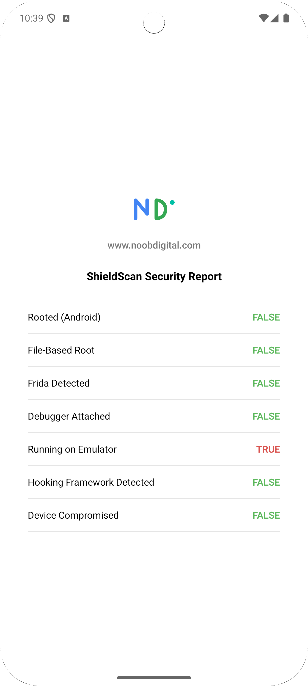
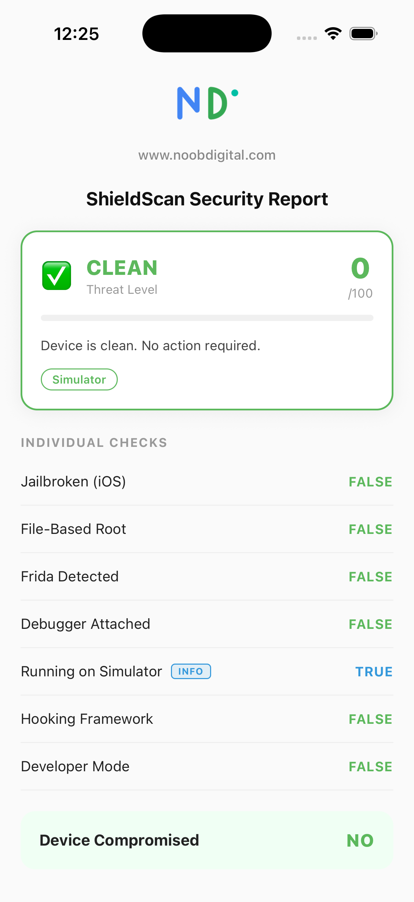

<p align="center">
  
</p>

<h1 align="center">@noobdigital/react-native-shieldscan</h1>


<p align="center">
  <a href="https://www.npmjs.com/package/@noobdigital/react-native-shieldscan"></a>
  <a href="https://www.npmjs.com/package/@noobdigital/react-native-shieldscan"></a>
  <a href="LICENSE"></a>
  
  
</p>

## Overview


**Noob Digital ShieldScan**  is a React Native Runtime Security and Screen Privacy SDK that helps identify compromised devices, active runtime attacks, and data exposure risks before they impact your application.

ShieldScan detects jailbreaks, root access, Frida instrumentation, hooking frameworks, attached debuggers, emulators, and insecure device configurations, while providing native screen privacy controls to prevent screenshots, screen recordings, and sensitive data exposure through the app switcher.

Designed for enterprise, fintech, healthcare, government, and identity-based applications, ShieldScan combines security signals into a weighted risk-scoring engine that enables tiered enforcement strategies ranging from monitoring and telemetry to feature restriction and session termination.

Delivered as a single native module for iOS and Android, ShieldScan supports both React Native New Architecture (TurboModules/JSI) and the legacy Bridge architecture.


> **Always install the latest published version.** Detection logic, indicator lists, and platform compatibility
> are actively maintained — running an older version means missing accuracy fixes and OS-compatibility updates.
> Check [npm](https://www.npmjs.com/package/@noobdigital/react-native-shieldscan) for the current release before reporting an issue.Also, always check [CHANGELOG.md](CHANGELOG.md) for version-by-version release notes. Highlights of the current release


---
---

## Features

### Runtime Security Detection

| Check | iOS | Android |
|---|---|---|
| Jailbreak / Root | ✅ File paths + sandbox write test + symlink check | ✅ RootBeer `0.1.2` |
| File-based root | ✅ Cydia, MobileSubstrate, bash, sshd | ✅ Magisk, SuperSU, Xposed, Zygisk paths |
| Frida detection | ✅ dylib injection + port 27042 + env var | ✅ File paths + port 27042 + `/proc/self/maps` |
| Debugger attached | ✅ `kinfo_proc` / `P_TRACED` via `sysctl` | ✅ `Debug.isDebuggerConnected()` + `waitingForDebugger()` + `TracerPid` |
| Emulator / Simulator | ✅ `targetEnvironment(simulator)` | ✅ Build fingerprint + sensor count heuristic (covers Bluestacks, Nox, LDPlayer, Genymotion, MEmu) |
| Hooking frameworks | ✅ dyld image scan (Substrate, Substitute, LibHooker) | ✅ Package scan + stack trace probe + `/proc/self/maps` (Xposed, LSPosed, Frida gadget, SandHook) |
| Developer mode | ✅ Always `false` (no public iOS API) | ✅ `Settings.Secure.DEVELOPMENT_SETTINGS_ENABLED` |

### Screen Security

| Feature | iOS | Android |
|---|---|---|
| Background blur | ✅ Overlay shown on `willResignActive`, removed on `didBecomeActive` | ✅ Overlay shown on window focus loss (app switcher / Home), removed on regain |
| Screenshot / recording prevention | ✅ Secure `UITextField` layer trick — blank in captures, visible on-device | ✅ `WindowManager.LayoutParams.FLAG_SECURE` — blank in captures **and** in the recents card |
| Screen recording detection | ✅ `UIScreen.main.isCaptured`, any iOS version | ⚠️ Android 15 (API 35)+ only, via `WindowManager.addScreenRecordingCallback`. Resolves `false` on older OS versions — there is no public API pre-15 |

> Android: `FLAG_SECURE` blanks the recents card entirely — the cover overlay message won't render there if both features are active at once. OS-level restriction, not a bug.

---

## Screenshots

Example app running on Android emulator and iOS Simulator.
<p align="center">
  
  &nbsp;&nbsp;&nbsp;&nbsp;
  
</p>

---

## Installation

```sh
npm install @noobdigital/react-native-shieldscan
# or
yarn add @noobdigital/react-native-shieldscan
```

### iOS

```sh
cd ios && pod install
```

#### Auto-linked via React Native 0.60+ auto-linking. No manual steps required.

**Android permission:** the module declares `DETECT_SCREEN_RECORDING` (install-time, non-sensitive). Merged automatically — no action needed in your app manifest.

---

## Usage

### Full result object

```typescript
import { runSecurityChecks } from '@noobdigital/react-native-shieldscan';

const result = await runSecurityChecks();

console.log(result);
// {
//   rooted:        false,
//   fileBasedRoot: false,
//   fridaDetected: false,
//   debugger:      false,
//   emulator:      false,
//   hooksDetected: false,
//   developerMode: false,
// }
```

### Single boolean gate

```typescript
import { isDeviceCompromised } from '@noobdigital/react-native-shieldscan';

const compromised = await isDeviceCompromised();

if (compromised) {
  Alert.alert('Security Error', 'This app cannot run on a compromised device.');
}
```

### Enterprise — risk scoring engine 

```typescript
import { getDeviceRiskAssessment } from '@noobdigital/react-native-shieldscan';

const assessment = await getDeviceRiskAssessment();

console.log(assessment);
// {
//   compromised:    false,
//   threatLevel:    'CLEAN',   // CLEAN | LOW | MEDIUM | HIGH | CRITICAL
//   score:          0,         // 0–100 weighted risk score
//   signals:        [],        // which signals fired
//   recommendation: 'Device is clean. No action required.'
// }
```

Tiered response based on threat level:

```typescript
switch (assessment.threatLevel) {
  case 'CLEAN':
    // proceed normally
    break;
  case 'LOW':
    // log only — e.g. developer mode on, expected in dev/QA
    break;
  case 'MEDIUM':
    // restrict sensitive features (payments, PII)
    break;
  case 'HIGH':
    // block sensitive flows, require re-authentication
    break;
  case 'CRITICAL':
    // Frida/hooks detected — terminate session immediately
    await revokeSessionToken();
    BackHandler.exitApp();
    break;
}
```

### Recommended — startup enforcement with telemetry

```typescript
import { getDeviceRiskAssessment } from '@noobdigital/react-native-shieldscan';

async function enforceDeviceSecurity() {
  const assessment = await getDeviceRiskAssessment();

  // Always log everything to your security backend
  analytics.track('device_security_assessment', {
    score:       assessment.score,
    threatLevel: assessment.threatLevel,
    signals:     assessment.signals,
    platform:    Platform.OS,
  });

  if (assessment.threatLevel === 'CRITICAL') {
    throw new Error('COMPROMISED_DEVICE');
  }
}
```

### Screen Security — background blur 

Shows a cover screen with a protective message whenever the app is backgrounded or the app switcher is opened, hiding sensitive content from the recents thumbnail.

```typescript
import { setBlurEnabled } from '@noobdigital/react-native-shieldscan';

// Enable on a sensitive screen
await setBlurEnabled(true);

// Disable when leaving that screen
await setBlurEnabled(false);
```

> Enabling this just arms the feature — the overlay itself only appears once the app actually loses focus (Home pressed, app switcher opened, etc.), not immediately on the call.

### Screen Security — screenshot & recording prevention 

Blocks the content of the current screen from appearing in screenshots and screen recordings.

```typescript
import { setScreenshotPreventionEnabled } from '@noobdigital/react-native-shieldscan';

// Enable on a payment / card details screen
await setScreenshotPreventionEnabled(true);

// Disable when leaving that screen
await setScreenshotPreventionEnabled(false);
```

> On Android this also blanks the recents/app-switcher card — see the [platform trade-off note](#features) above if you're also using Background Blur.

### Screen Security — detecting an active screen recording

```typescript
import { isScreenBeingRecorded } from '@noobdigital/react-native-shieldscan';

const { isRecording } = await isScreenBeingRecorded();

if (isRecording) {
  // e.g. warn the user, or hide a sensitive value in JS as an extra layer
}
```

> Poll-on-demand only — call it when you need the current state (e.g. before revealing a sensitive value), rather than in a tight loop.

---

## API Reference

### `runSecurityChecks(): Promise<SecurityScanResult>`

Runs all security checks natively in a single call. Resolves with a `SecurityScanResult` object. All checks run in parallel on the native side.

### `isDeviceCompromised(): Promise<boolean>`

Convenience wrapper. Returns `true` if the risk score is ≥ 40 — meaning any of `rooted`, `fileBasedRoot`, `fridaDetected`, `debugger`, or `hooksDetected` is `true`.

> **Note:** `emulator` and `developerMode` alone never mark a device as compromised. `emulator` is excluded entirely from scoring. `developerMode` contributes only 5 points — below the 40-point threshold. Check them separately if your threat model requires blocking them.

### `getDeviceRiskAssessment(): Promise<CompromisedResult>`

Enterprise-grade weighted risk assessment. Returns a `CompromisedResult` with threat level, score, active signals, and a recommended action.

Signal weights:

| Signal | Weight | Rationale |
|---|---|---|
| `fridaDetected` | 40 pts | Active runtime instrumentation |
| `hooksDetected` | 40 pts | Active runtime instrumentation |
| `rooted` | 30 pts | OS integrity broken |
| `fileBasedRoot` | 20 pts | Artifacts present, not confirmed active |
| `debugger` | 10 pts | Suspicious in production |
| `developerMode` | 5 pts | Elevated attack surface |
| `emulator` | 0 pts | Informational only |

### `setBlurEnabled(enabled: boolean): Promise<boolean>`

Arms or disarms the background blur cover screen. Resolves with the value passed in. See [usage example](#screen-security--background-blur-v110) above.

### `setScreenshotPreventionEnabled(enabled: boolean): Promise<boolean>`

Enables or disables screenshot/recording blocking for the current screen. Resolves with the value passed in. See [usage example](#screen-security--screenshot--recording-prevention-v110) above.

### `isScreenBeingRecorded(): Promise<{ isRecording: boolean }>`

Returns whether the screen is currently being captured by a recording/casting session at the moment of the call. See [usage example](#screen-security--detecting-an-active-screen-recording-v110) above.

### `SecurityScanResult`

```typescript
interface SecurityScanResult {
  /**
   * True if RootBeer (Android) or jailbreak file paths (iOS) detect
   * a compromised OS environment. Primary root/jailbreak signal.
   */
  rooted: boolean;

  /**
   * True if known root, jailbreak, or Frida file paths exist on disk.
   * Android: /sbin/su, /magisk, XposedBridge.jar, Zygisk modules
   * iOS: /Applications/Cydia.app, /bin/bash, /usr/sbin/sshd
   */
  fileBasedRoot: boolean;

  /**
   * True if Frida instrumentation framework is detected.
   * Checks: known file paths + TCP port 27042 + environment variables
   * + dylib injection (iOS) + /proc/self/maps scan (Android).
   */
  fridaDetected: boolean;

  /**
   * True if a debugger is currently attached to the process.
   * iOS: sysctl kinfo_proc P_TRACED flag.
   * Android: Debug.isDebuggerConnected() + waitingForDebugger() + TracerPid.
   */
  debugger: boolean;

  /**
   * True if running on an Android emulator or iOS Simulator.
   * iOS: compile-time targetEnvironment(simulator).
   * Android: Build fingerprint heuristics + sensor count (< 5 sensors).
   * Covers: AOSP, Genymotion, Bluestacks, Nox, LDPlayer, MEmu, Andy, Droid4X.
   */
  emulator: boolean;

  /**
   * True if a runtime hooking framework is detected.
   * iOS: dyld image scan for Substrate, Substitute, LibHooker, TweakInject.
   * Android: package scan (Xposed/LSPosed managers) + stack trace probe
   *          + /proc/self/maps scan for XposedBridge, frida-gadget, SandHook.
   */
  hooksDetected: boolean;

  /**
   * True if developer options/mode is enabled on the device.
   * Android: Settings.Secure.DEVELOPMENT_SETTINGS_ENABLED.
   * iOS: Always false — no public API exposes developer mode on iOS.
   */
  developerMode: boolean;
}
```

### `CompromisedResult`

```typescript
interface CompromisedResult {
  /** True if risk score >= 40 */
  compromised: boolean;
  /** CLEAN | LOW | MEDIUM | HIGH | CRITICAL */
  threatLevel: ThreatLevel;
  /** Weighted risk score 0–100 */
  score: number;
  /** Which signals fired */
  signals: string[];
  /** Recommended action for the consuming app */
  recommendation: string;
}
```

---

## Example App

A working example app is included in the repository under `example/SampleApp/`.

It demonstrates all seven security checks with a live result screen including risk score card, threat level indicator, and per-check severity badges — plus a Screen Security panel to toggle background blur and screenshot prevention live, and a screen recording status indicator.

### Running the example

```sh
# Clone the repo
git clone https://github.com/NoobDigital/react-native-shieldscan.git
cd react-native-shieldscan

# Install dependencies
yarn install

# iOS
cd example/SampleApp && yarn install
cd ios && pod install && cd ..
yarn ios

# Android
cd example/SampleApp && yarn install
yarn android
```


---

## Security Notes

**False positive guarantee**
`hooksDetected` returns `false` on BrowserStack, LambdaTest, Firebase Test Lab, AWS Device Farm real devices, and any device with ADB enabled, developer options on, or corporate/MDM certificates installed. Only genuine hooking framework artifacts trigger this signal.

**`developerMode` in production**
`developerMode: true` alone does not mark a device as compromised — it contributes only 5 points to the risk score, well below the 40-point threshold. It is an informational signal. Guard hard blocks with `!__DEV__` to avoid blocking your own development workflow.

**Simulator / emulator**
`emulator: true` never contributes to the risk score. It is excluded from `isDeviceCompromised()`. Many teams run QA on emulators — this signal is informational only unless you explicitly require blocking it.

**Debugger flag in development**
`debugger: true` is expected during Xcode and Android Studio debug sessions. Guard hard blocks with `!__DEV__`.

**Frida port check latency**
The TCP socket probe to `127.0.0.1:27042` adds approximately 50–300ms on a clean device (connection refused with explicit timeout). This is acceptable for a one-time startup check. Avoid calling `runSecurityChecks()` in render loops or hot paths.

**RootBeer version**
Android root detection uses RootBeer `0.1.2`, which includes 16 KB ELF page size alignment required for Android 15+ / Google Play compliance from November 2025.

**Simulator guards on iOS**
Jailbreak and hook detection checks are disabled at compile time on the iOS Simulator via `#if targetEnvironment(simulator)`. This prevents false positives from macOS filesystem paths (e.g. `/bin/bash`) that exist on the simulator host but are not jailbreak indicators.

**Android: Screenshot Prevention blanks Background Blur in recents**
`FLAG_SECURE` operates at the OS compositor level — it instructs Android to never render the window's content into *any* snapshot (recents card, screenshots, screen recordings, casting), regardless of what views are in the hierarchy. If both `setBlurEnabled(true)` and `setScreenshotPreventionEnabled(true)` are active, the recents card will show a blank/white card, not your blur message — the OS discards the entire frame before any snapshot consumer sees it. This is expected, by-design Android behavior, not a bug, and there is no workaround at the app level. If both your message and hard capture-blocking matter, consider gating the UI so users understand only one visual outcome is possible on Android at a time; iOS has no equivalent conflict since its two features use independent mechanisms.

**Android: screen recording detection requires API 35+**
`isScreenBeingRecorded()` uses `WindowManager.addScreenRecordingCallback`, introduced in Android 15 (API 35), and requires the `DETECT_SCREEN_RECORDING` manifest permission (declared automatically by this library). On devices below API 35, it resolves `false` — there is no public, reliable screen-recording-detection API on earlier Android versions. It also only detects `MediaProjection`-based recorders (Android's built-in recorder and most third-party apps); tools like `scrcpy` or the low-level `screenrecord` binary are not identified as recording sessions by this Android API.

**Android: manifest permission is a library-level declaration**
`DETECT_SCREEN_RECORDING` is a normal, install-time permission — it does not trigger a Google Play sensitive-permissions declaration form, extended review, or a runtime user prompt. It's merged into consuming apps automatically via Gradle's manifest merger; no action is required in your app's manifest or Play Console listing.

---

## VAPT Compliance

Developed and validated against OWASP Mobile Top 10:

| VAPT Finding | OWASP Reference | ShieldScan Signal |
|---|---|---|
| App does not detect jailbroken/rooted devices | M8, M9 | `rooted`, `fileBasedRoot` |
| Frida can attach and instrument the app at runtime | M10 | `fridaDetected`, `hooksDetected` |
| No debugger detection mechanism | M8 | `debugger` |
| Hooking frameworks (Xposed, Substrate) not detected | M10 | `hooksDetected` |
| App runs on emulator without restriction | M8 | `emulator` |
| Developer options not detected | M8 | `developerMode` |
| Sensitive content exposed in app switcher / recents | M9 | `setBlurEnabled` |
| Sensitive content captured via screenshot or screen recording | M9 | `setScreenshotPreventionEnabled`, `isScreenBeingRecorded` |

---

## Contributing

Pull requests are welcome.

---

## License

MIT © [noobdigital](https://noobdigital.com)